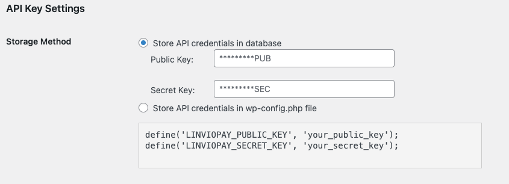

# Minimal LinvioPay Universal Terminal Wordpress plugin
A minimal WordPress plugin that integrates LinvioPay Universal Terminal to capture payments and save payment methods on any page or post by means of a provided shortcode. It also provides a minimal admin interface.

## Security Notice

This plugin is provided as is: API secret key security is the responsibility of the USER and not Linvio, LinvioPay or developers of this plugin. USE AT OWN RISK.

**For sandbox**, and ease of testing, the LinvioPay API keys can be stored simply and easily in WordPress's option table. WE STRONGLY SUGGEST YOU DO NOT USE THIS INSECURE PROCESS FOR PRODUCTION.


**For production**, a more secure option for storing API keys is in the wp-config.php file. Please verify your htaccess secures wp-config.php from public web access.



**REMEMBER**: API keys are not encrypted, please ensure your server and site are properly secured before deploying your production keys.

## Features

- Minimal Admin settings screen to configure Public and Secret API keys, products and mappings.
- Shortcode `[uterm]` to render and initialize the LinvioPay terminal.
- Sends secure API calls to LinvioPay.
- Displays a terminal widget dynamically via JavaScript.

# Requirements

- [Optional] Docker compose.
- PHP 7.2+
- WordPress 5.0+
- A valid LinvioPay API key pair (public & secret)

## Installation

1. [Optional] Execute `docker compose up` to get a new Wordpress installation. Open http://localhost:8080 and perform the initial Wordpress configuration.
2. Copy the plugin directory (`uterm-wp`) and place them in the `wp-content/plugins` directory inside your wordpress installation directory. If running from docker, the plugin should be automatically copied.
3. Activate the plugin through the WordPress admin dashboard (http://localhost:8080/wp-admin/plugins.php).
4. Go to the **Uterm** section in the Admin Area to enter your Public and Secret API keys.

If you want to locally test this code, you can use the provided `docker-compose.yml` file. It will automatically download all the required docker images and install the plugin. Once running, the wordpress site will be accessible from http://localhost:8080

## Usage

### Payment capture mode

Add the `[uterm]` shortcode to any page or post where you want the LinvioPay terminal to appear.

Example:

```html
<h1>CheckoutPage</h1>

[uterm]
```

### Payment Method save mode

Add the `[uterm mode="payment_method"]` shortcode to any page or post where you want the LinvioPay terminal to appear.

Example:

```html
<h1>CheckoutPage</h1>

[uterm mode="payment_method"]
```

When opening the page containing the terminal, please provide the following URL params:

- **cid**: The Salesforce Contact Synchronization Id. Payment methods saved will be attached to this Salesforce Contact Record.
- **email**: Salesforce Contact email. Will be used for creating a LinvioPay Contact for the provided `cid` in case it was not previously created.
- [Optional] **first_name**
- [Optional] **last_name**

# License

MIT License. Feel free to modify and reuse.

# Support

This is a custom plugin. For official LinvioPay support, visit https://linviopay.com.
